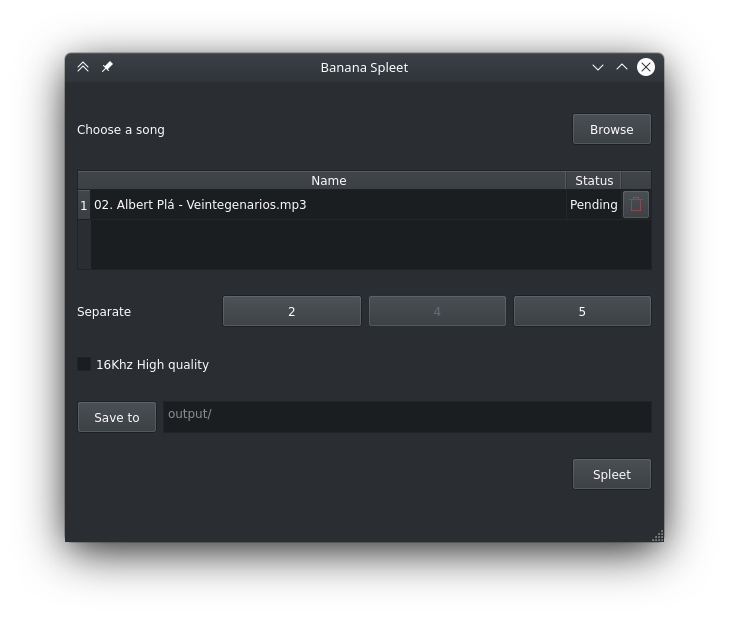

# Banana Spleet

### A simple multiplatform front end for [Spleeter](https://github.com/deezer/spleeter) audio separation tool by Deezer



Made with python and PyQt5.

### Getting started

- Dowload executable from [latest release]()

- Select any song file(s) you want to spleet.

 - Select how many parts you want as end result.

- Select output folder, if unselected it will create a directory named ```output/```

### Run from source

```sh
# Optional: Create virtual enviroment
virtualenv env
source env/bin/activate

# Install dependencies
pip install spleeter pyqt5

# Run python script
python src/main.py
```
### TODO
- [ ] Create executable for Linux, Windows and MacOs.
- [ ] Make high quality setting actually do something.


